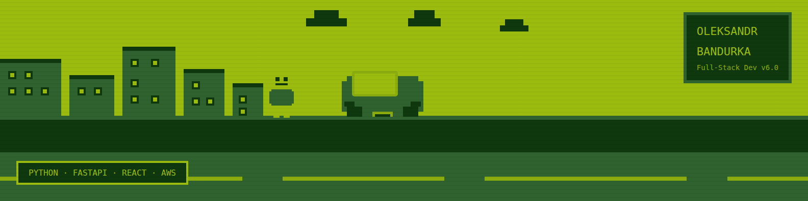

## 🧑‍💻 About

Full-Stack Developer with **6+ years** shipping products that scale — 10,000+ concurrent users, sub-100ms API responses, zero-downtime deployments across **FinTech** and **Retail**.

🐍 **FastAPI** and **Django** are the backend home.
⚛️ **React** and **Next.js** for when the team needs one person to close both sides.
☁️ Async remote-first · clear docs · on-time delivery · open to **EU & USA** product companies.

---

## ⚡ What I Bring

| Area | Stack |
|------|-------|
| 🔧 **Backend** | Python, FastAPI, Django, DRF, PostgreSQL, Redis, Celery, async |
| 🎨 **Frontend** | TypeScript-first React / Next.js, SSR/SSG, Core Web Vitals |
| 🚀 **DevOps** | Docker, GitHub Actions CI/CD, AWS (Lambda, EC2, S3), GCP |

---

## 🛠️ Tech Stack

**Backend**

**Frontend**

**Cloud & DevOps**

---

## 🏆 Certifications

- 🟡 **AWS Certified Developer** — Amazon Web Services · 2024 · `Z6F9L4BB`
- 🔵 **Google Associate Cloud Engineer** — Google Cloud · `GCP ACE`
- 🐳 **Docker Certified Associate** — Docker, Inc · `DCA`

---

## 🚀 Featured Project

### 💰 Lunch Money — Personal Finance & Budgeting Platform

> Personal finance platform serving thousands of users globally — multi-currency transactions, real-time dashboard, bank integrations.

- 🔄 Core transaction pipeline — Python/Django, multi-currency, high accuracy
- 📊 Interactive budget dashboard — React/TypeScript, spending breakdowns, real-time net worth
- ⚡ PostgreSQL optimizations on 2M+ records — **40% faster** monthly summary load
- 🏦 Bank & investment APIs with retry logic for unreliable third-party sources
- 🐳 Docker local dev + GitHub Actions CI pipeline

---

## 🎓 Education

🎓 **Master of Computer Science** — Lviv Polytechnic National University · 2016–2018

🎓 **Bachelor of Computer Science** — Lviv Polytechnic National University · 2012–2016

---

## 🌐 Languages

- 🇺🇦 **Ukrainian** — Native
- 🇬🇧 **English** — Fluent

---
